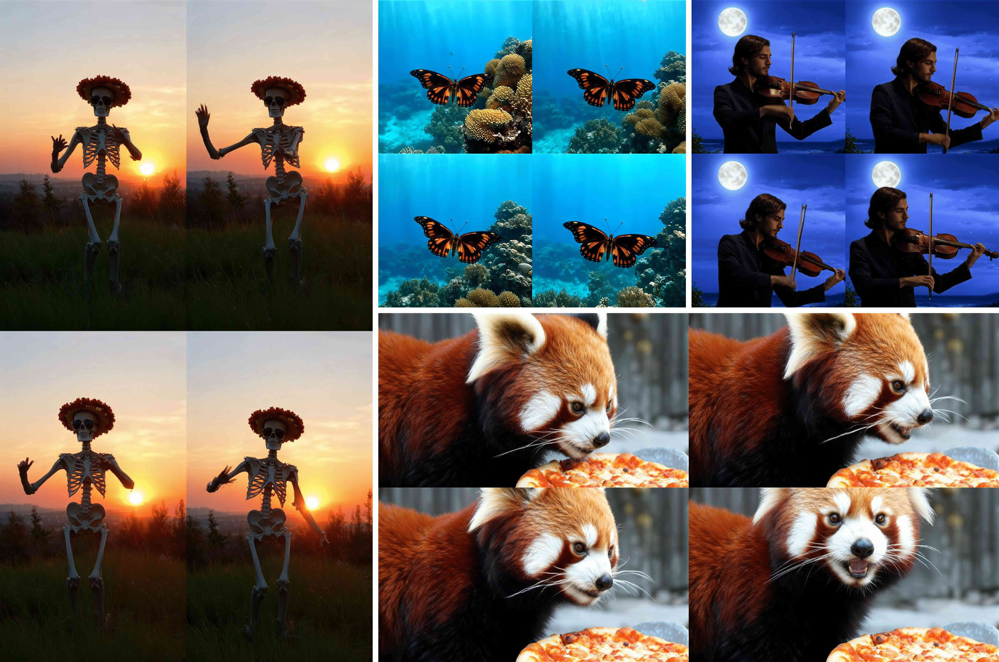
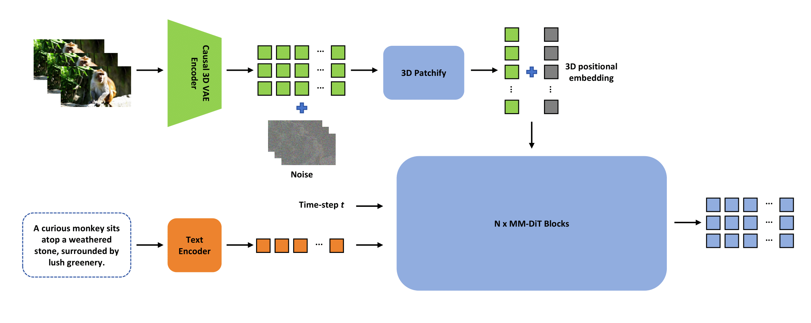

# ContentV: Efficient Training of Video Generation Models with Limited Compute

<div align="center">
<p align="center">
  <a href="https://contentv.github.io">
    
  </a>
  <!-- <a>
    
  </a> -->
  <a href="https://huggingface.co/ByteDance/ContentV-8B">
    
  </a>
  <a href="https://github.com/bytedance/ContentV">
    
  </a>
  <a href="https://www.apache.org/licenses/LICENSE-2.0">
    
  </a>
</p>
</div>

This project presents ContentV, a novel framework that accelerates DiT-based video generation through three key innovations:
- A minimalist model design that enables effective reuse of pre-trained image generation models for video synthesis
- A comprehensive exploration of a multi-stage, efficient training strategy based on Flow Matching
- A low-cost Reinforcement Learning with Human Feedback (RLHF) approach that further enhances generation quality without the need for additional human annotations.

<div align="center">
    
    
</div>

## ⚡ Quickstart

#### Recommended PyTorch Version

- GPU: torch >= 2.3.1 (CUDA >= 12.2)
- NPU: torch and torch-npu >= 2.1.0 (CANN >= 8.0.RC2). Please refer to [Ascend Extension for PyTorch](https://gitee.com/ascend/pytorch) for the installation of torch-npu.

#### Installation

```bash
git clone https://github.com/bytedance/ContentV.git
cd ContentV
pip3 install -r requirements.txt
```

#### T2V Generation

```bash
## For GPU
python3 demo.py
## For NPU
USE_ASCEND_NPU=1 python3 demo.py
```

## ✅ Todo List
- [x] Inference code and checkpoints
- [ ] Training code of RLHF

## 🧾 License
This code repository and part of the model weights are licensed under the [Apache 2.0 License](https://www.apache.org/licenses/LICENSE-2.0). Please note that:
- MM DiT are derived from [Stable Diffusion 3.5 Large](https://huggingface.co/stabilityai/stable-diffusion-3.5-large) and trained with video samples. This Stability AI Model is licensed under the [Stability AI Community License](https://stability.ai/community-license-agreement), Copyright ©  Stability AI Ltd. All Rights Reserved
- Video VAE from [Wan2.1](https://huggingface.co/Wan-AI/Wan2.1-T2V-14B) is licensed under [Apache 2.0 License](https://huggingface.co/Wan-AI/Wan2.1-T2V-14B/blob/main/LICENSE.txt)

## ❤️ Acknowledgement
* [Stable Diffusion 3.5 Large](https://huggingface.co/stabilityai/stable-diffusion-3.5-large)
* [Wan2.1](https://github.com/Wan-Video/Wan2.1)
* [Diffusers](https://github.com/huggingface/diffusers)
* [HuggingFace](https://huggingface.co)

## 🔗 Citation

```bibtex
@article{contentv2025,
  title     = {ContentV: Efficient Training of Video Generation Models with Limited Compute},
  author    = {Bytedance Douyin Content Team},
  year      = {2025},
  }
```
